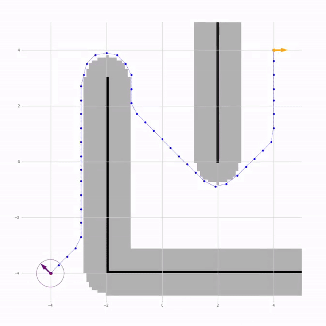
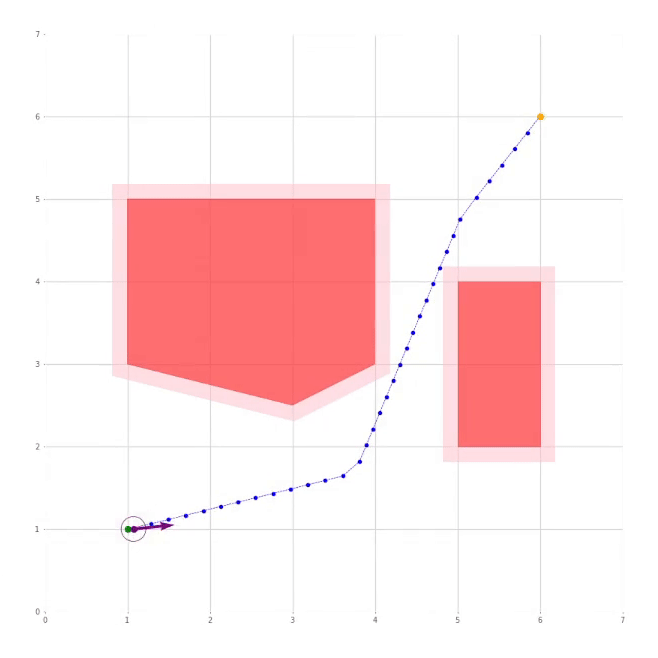
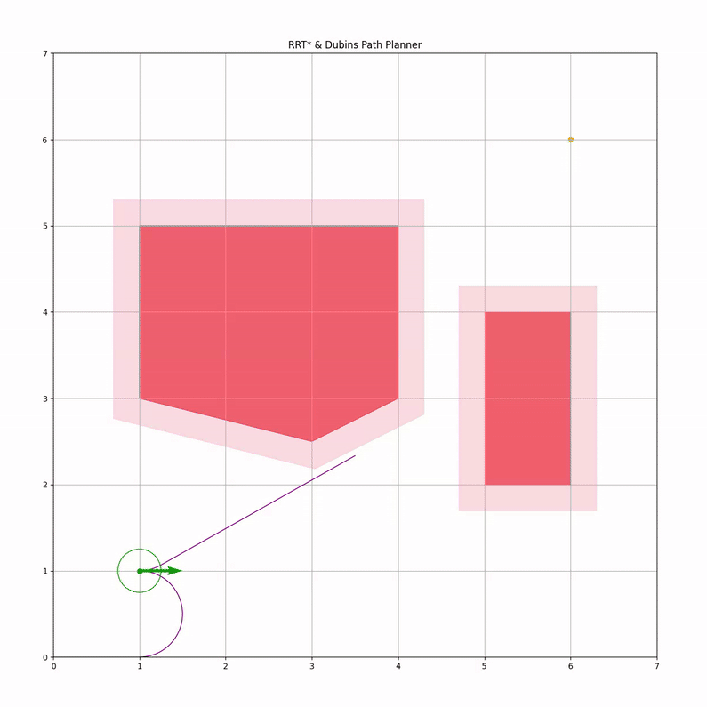
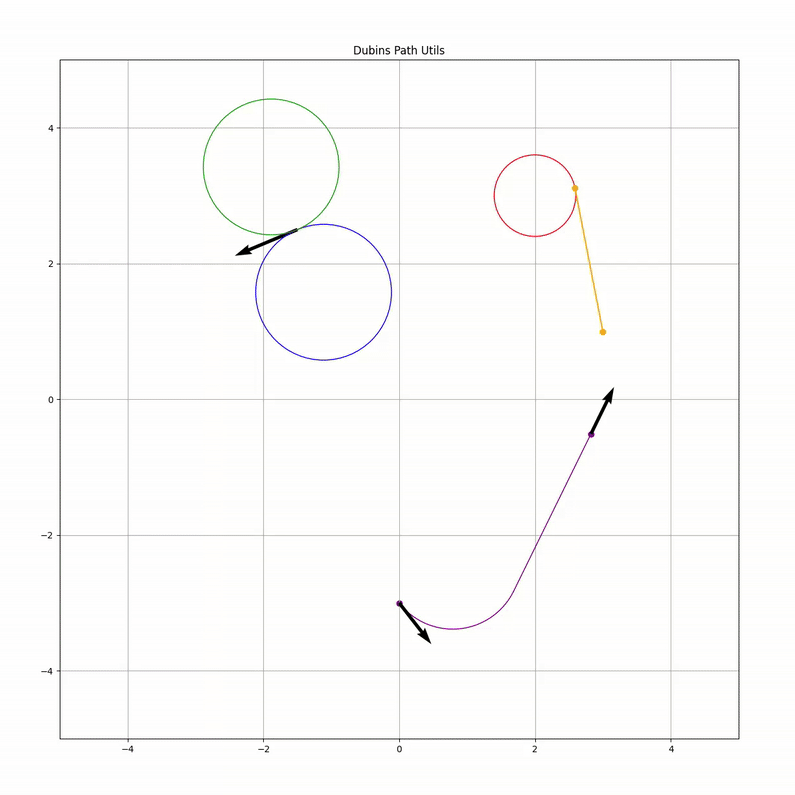
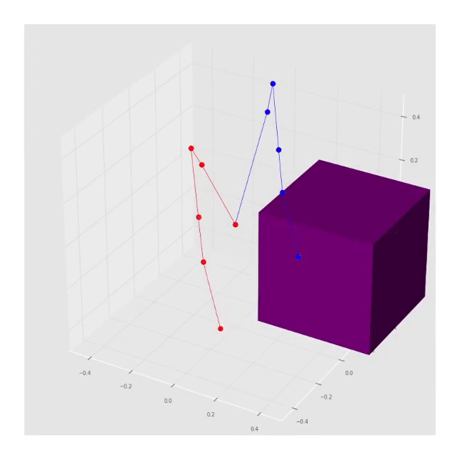

# TASER — Two-Armed Self-Equilibrating Robot

## Overview

An Isaac Sim simulation of a self-balancing wheeled robot with arms, combining navigation, reinforcement learning-trained locomotion, and inverse kinematics-based manipulation.


### Navigation

TASER has two navigation stack implementations:

|       | Obstacle Representation | Path Planner                                   | Tracking Controller            |
| ----- | ----------------------- | ---------------------------------------------- | ------------------------------ |
| Left  | Occupancy Grid          | Distance Transform (from the Robotics Toolbox) | Pure Pursuit                   |
| Right | Polygonal Obstacles     | RRT* with Dubins Paths                         | Model Predictive Control (MPC) |

<div align="center">
    
    
</div>

#### RRT* Path Planner

The RRT* path planner is implemented in C++ and generates Dubins paths using geometric primitives.

<div align="center">
    
    
</div>

### Locomotion

To achieve self-balancing locomotion, TASER is trained using reinforcement learning with Isaac Lab and Proximal Policy Optimization (PPO). Two tasks are defined:

1. **Balance (top)**: The joint velocity action range is kept small to ensure stable balancing while the robot is at an idle state.
2. **Track Velocity (bottom)**: The joint velocity action range is increased to allow the robot to track a desired velocity of the shape (lin_x, ang_z) while maintaining balance.

For both tasks, the robot arms' joint positions and velocities are randomized at the start of each episode to accommodate different center of mass configurations.


### Manipulation

Each of the robot's arms consists of 3 revolute joints around the axes: y, z, y.

The pick manipulation task is implemented with simple inverse kinematics. First, the arms reach toward the target by computing desired joint positions and tracking them with a PD controller, then the picking motion is executed by commanding joint velocities along the y- and z-axes.

<div align="center">
    
</div>

## Usage

- Create a `.env` file in the `docker/` directory based on the provided `.env.template`.

- Run the project's docker container either in a VSCode Dev Container or using:

    ```bash
    docker compose -f docker/compose.yaml run --build taser bash
    ```

- Launch the Isaac Sim simulation:

    ```bash
    sim_isaac

    # or
    omni_python src/taser/isaacsim/sim.py
    ```