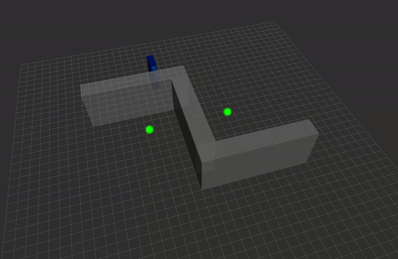
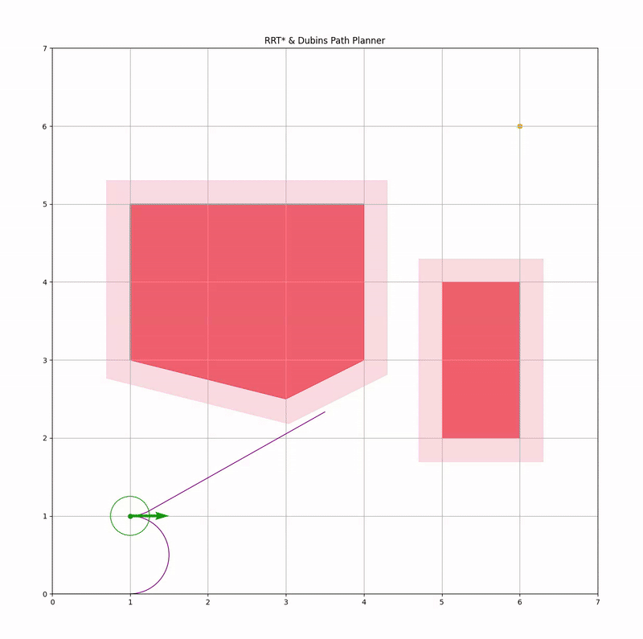
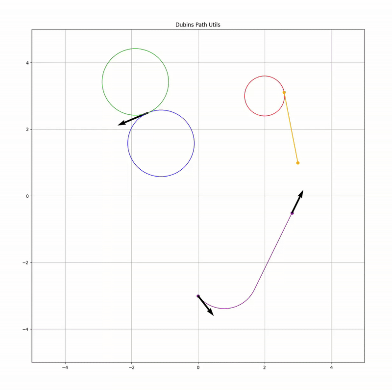
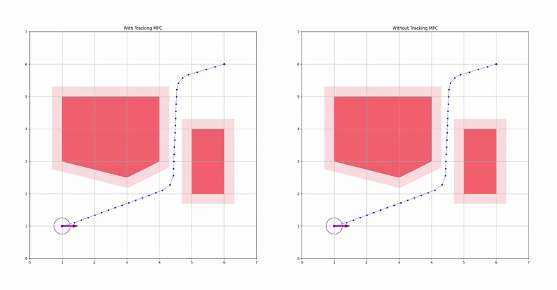
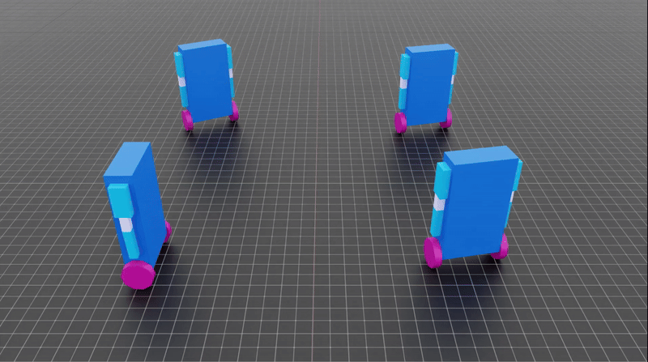

# TASER — Two-Armed Self-Equilibrating Robot

## Overview

A wheeled robot with two arms that detects targets in an environment and moves towards them to catch them.

### Environment

- ROS 2 Jazzy
- Rviz Simulation (without physics)
- Isaac Lab for RL training with physics

    

### Arms

The robot has two arms, each with 3 revolute joints around the axes: y, z, y.

Each arm consists of:

- A PID position controller that outputs end-effector velocities for a desired end-effector position.
- A kinematics model that computes joint velocities from the desired end-effector velocities using differential inverse kinematics.

To Do: The arms will be trained with reinforcement learning in Isaac Lab to move efficiently towards a target while avoiding self-collisions and obstacles.

### Base

The base consists of:

#### RRT* & Dubins Path Planner

The RRT* path planner uses Dubins paths to plan a path from a starting pose to a goal position while avoiding static obstacles.

    
    

#### Tracking Controller

The tracking controller uses Model Predictive Control (MPC) to track the generated path and avoid drifting from it.

The MPC uses linearized dynamics of the differential drive model.

    

### RL Training for Balancing

The Rviz simulation does not include physics or gravity, so the robot never has to stay in balance to avoid falling over.

Isaac Lab is thus used to train the robot to stay balanced in a realistic simulation environment with gravity. The robot is trained in different scenarios:

- Stationary:

- Tracking linear and angular velocities generated from the MPC tracking controller:

### State Machine

The robot uses a state machine to manage its behavior.

States:
  - **IDLE**: The robot is idle and waiting for a target to be spawned.
  - **REST_ARMS**: The robot moves its arms to a resting position on its sides.
  - **GRAB**: The robot moves its arms to grab a target.
  - **MOVE_BASE**: The robot moves towards a target or a given position.

The current behavior uses the following transitions:

IDLE -> MOVE_BASE -> GRAB -> REST_ARMS -> IDLE

## ROS Packages

| Package | Description |
| --- | --- |
| taser | Robot logic (ROS-independent) |
| taser_py | Python bindings of the core package |
| taser_ros | ROS interface and node, URDF files, Rviz, launch files |
| taser_isaaclab | Isaac Lab environment for RL training |
| taser_msgs | Custom ROS messages |
| state_machine | State machine, states, and missions |
